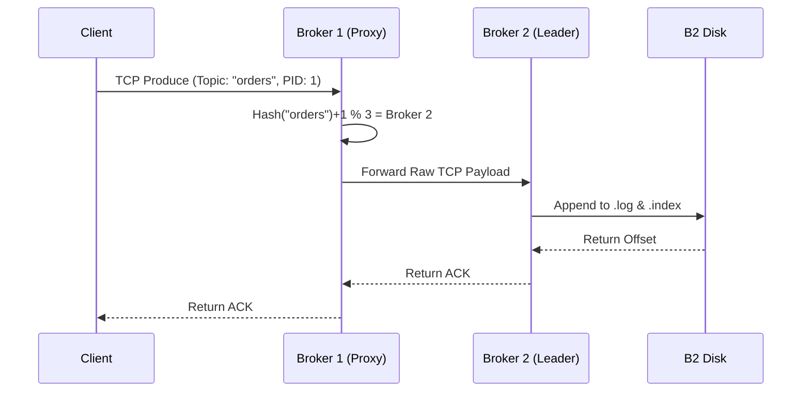

# 🏛️ Architecture Overview

The broker is composed of decoupled, concurrent subsystems operating over a shared, lock-protected state. 

## Component Topology

1. **Protocol Server (`internal/protocol`)**
   The entry point. A custom TCP server parsing binary frames. It routes specific command bytes (e.g., `CmdProduce=1`, `CmdFetch=2`) to injected handler functions.
2. **Cluster Manager (`internal/cluster`)**
   Maintains the dynamic peer topology. Broadcasts node state via an Epidemic Gossip Protocol and tracks dead peers using a Tombstone map to prevent ghost flapping.
3. **Topic Manager (`internal/topic`)**
   The logical routing layer. Translates a logical `Topic` + `PartitionID` request into physical disk mapping. It executes deterministic hashing `(Hash(Topic) + Partition) % TotalBrokers` to designate `RoleLeader` or `RoleFollower`.
4. **Storage Engine (`internal/storage`)**
   The physical boundary. Agnostic to network and clustering, it safely controls concurrent I/O to physical `.log` and `.index` segment files.

## Request Lifecycle: Smart Proxy Produce

To simplify client SDKs, the broker acts as a smart gateway.

