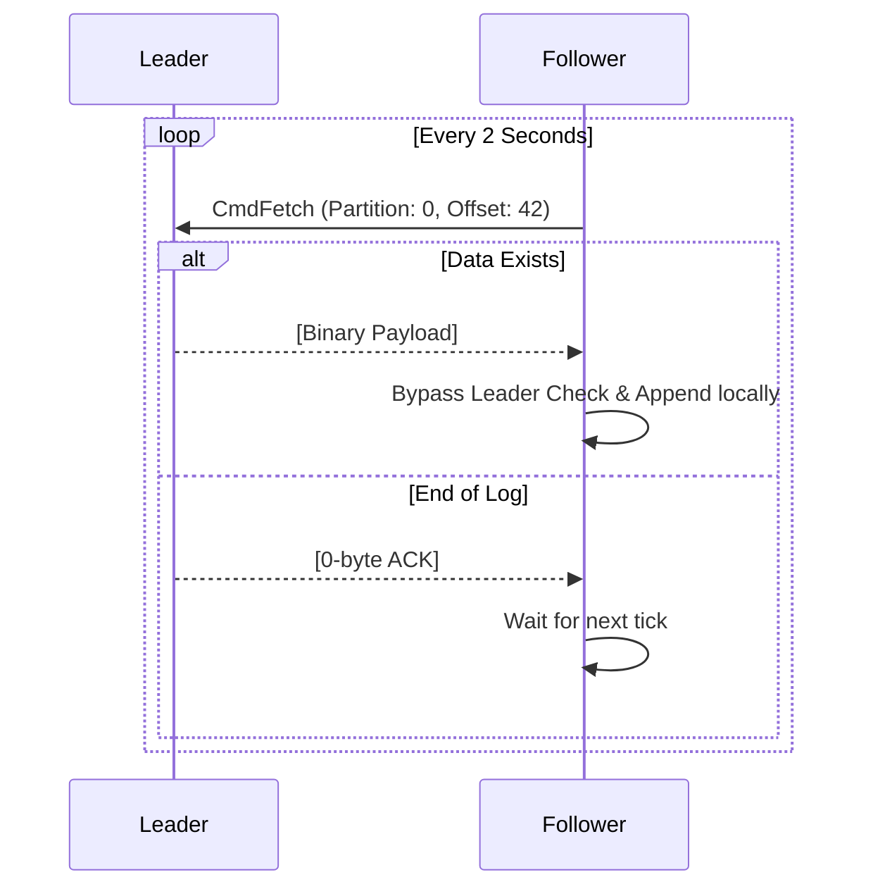

# 🔄 Replication Model

The broker implements a **Pull-Based Replication** strategy, operating completely asynchronously from the client write path.

## Leader Assignment & Discovery

Roles are computed deterministically. Followers do not wait for explicit instruction; they discover their responsibilities dynamically:
1. Every 2 seconds, the background Replicator worker executes `CmdMetadataSync` against known peers.
2. If it discovers a peer leading a partition that the local node does not have, it instantiates the directory locally.

## The Pull-Fetcher Loop

Once a partition folder exists, the Follower begins continuous synchronization.

## Consistency Guarantees
The system currently provides Eventual Consistency. A Leader ACKs the client immediately upon local disk flush. Replication happens asynchronously. (Note: Achieving strict consistency would require implementing an acks=all mechanism paired with In-Sync Replica (ISR) tracking, planned for a future consensus iteration).